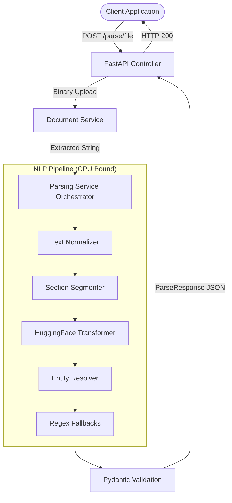

# AI Resume Parser

A production-grade NLP service that ingests resumes (PDF, DOCX, DOC) and extracts structured JSON data using a hybrid architecture of HuggingFace Transformers (BERT) and deterministic Regex heuristics.

## Features
- **Multi-Format Extraction**: Parses PDF (PyMuPDF), DOCX (python-docx), and DOC (LibreOffice headless).
- **Hybrid AI/Deterministic Pipeline**: Leverages `yashpwr/resume-ner-bert-v2` for semantic Entity Recognition and Regex state-machines for rigid formatting (Emails, Phones, Dates).
- **Graceful Degradation**: If the Deep Learning model hallucinates or fails, lightweight heuristic fallbacks instantly take over to guarantee partial data extraction.
- **Strict Pydantic Contracts**: Ensures the API never leaks unformatted or null-only objects to the client.
- **Dockerized**: Fully isolated environment with pre-downloaded model weights for instantaneous, air-gapped booting.

## Architecture



## Prerequisites
- Docker & Docker Compose (Recommended)
- Python 3.11+ (For local development)
- LibreOffice (If running locally and `.doc` support is required)

## Installation & Running

### Using Docker (Production Recommended)
1. Build the image (this will download PyTorch and the HuggingFace model):
   ```bash
   docker build -t resume-parser:latest .
   ```
2. Run the container:
   ```bash
   docker run -d -p 8000:8000 --name parser resume-parser:latest
   ```

### Local Development
1. Create a virtual environment and install dependencies:
   ```bash
   python -m venv venv
   source venv/bin/activate
   pip install -r requirements.txt
   ```
2. Start the Uvicorn server:
   ```bash
   uvicorn app.main:app --reload
   ```

## API Documentation

### `GET /api/v1/health`
Checks if the service is running.
- **Response**: `{"status": "healthy", "service": "Resume Parser API", "version": "1.0.0"}`

### `POST /api/v1/parse/file`
Upload a resume file to be parsed.
- **Headers**: `Content-Type: multipart/form-data`
- **Body**: `file` (Binary File: .pdf, .docx, or .doc)

**Success Response (200 OK):**
```json
{
  "status": "success",
  "data": {
    "contact": {
      "name": "Jane Doe",
      "email": "jane@example.com",
      "phone": "+1 555-0199",
      "location": "San Francisco, CA"
    },
    "education": [
      {
        "institution": "Stanford University",
        "degree": "B.S. Computer Science",
        "graduation_year": "2023"
      }
    ],
    "experience": [
      {
        "company": "Tech Corp",
        "position": "Software Engineer",
        "duration": "2021-2023"
      }
    ],
    "projects": [],
    "certifications": [],
    "skills": ["AWS", "Python", "React"]
  },
  "message": "Resume parsed successfully"
}
```

**Error Response (415 Unsupported Media Type):**
```json
{
  "status": "error",
  "data": null,
  "message": "Unsupported file format: .txt. Expected .pdf, .docx, or .doc"
}
```

## Testing
Run the pytest suite to validate the deterministic heuristics and API boundaries:
```bash
pip install -r requirements-test.txt
PYTHONPATH=. pytest tests/ -v
```
